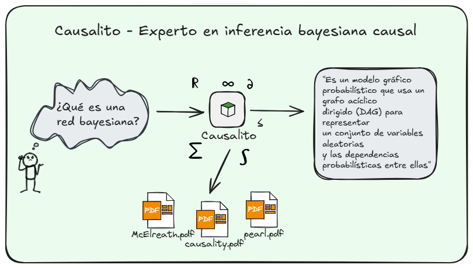
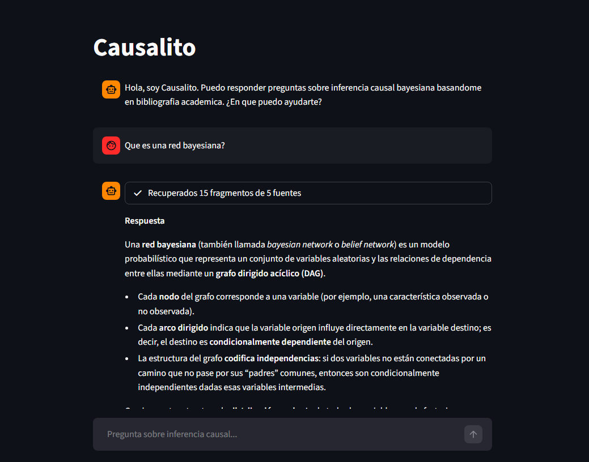

# Causalito - Agente RAG orientado a inferencia causal 

## Overview

**Causalito** es un agente inteligente diseñado para **asistir a estudiantes, investigadores y profesionales** en el campo de la inferencia bayesiana y causal. Su objetivo es proporcionar respuestas fundamentadas y precisas a consultas sobre inferencia causal, apoyándose en bibliografía académica de referencia en formato PDF.

A través de la integración de tecnologías de recuperación aumentada por generación (RAG), Causalito permite acceder de manera eficiente y transparente al conocimiento contenido en textos clave, facilitando el aprendizaje, la consulta y la aplicación rigurosa de conceptos complejos en estadística y causalidad.

Este proyecto **busca ser una herramienta confiable** y accesible para quienes requieren información verificada y contextualizada en el ámbito de la inferencia bayesiana causal.

## Beneficios clave

- **Respuestas fundamentadas:** el agente combina recuperación de texto con generación (RAG) para proporcionar respuestas ancladas en documentos académicos.
- **Trazabilidad:** cada fragmento recuperado se asocia a su fuente, facilitando la verificación y citación de las respuestas.
- **Reproducibilidad:** indexado persistente con Chroma y IDs estables permiten reproducir búsquedas y evitar reindexados innecesarios.
- **Extensibilidad:** arquitectura por módulos (loaders, chunkers, embedders, vectorstore, retriever, llm, agent) facilita sustituir componentes o adaptar el sistema a nuevas colecciones y modelos.

## A quién ayuda

- Estudiantes que necesitan explicaciones pedagógicas y referencias bibliográficas sobre inferencia bayesiana y causalidad.
- Investigadores que quieren recuperar rápidamente fragmentos relevantes de bibliografía y obtener resúmenes contextualizados.
- Ingenieros y desarrolladores que desean una base reproducible para construir agentes RAG orientados a dominios científicos.

## Documentación detallada

A continuación se presenta documentación detallada del proyecto presente en el directorio `docs/` y su propósito:

- [docs/execution.md](docs/execution.md): Instrucciones de ejecución (configuración de entorno virtual, ejecución de agente interactivo).
- [docs/ingestion.md](docs/ingestion.md): Descripción del pipeline de ingestión — loaders, `TextCleaner` y persistencia de `clean_documents.jsonl`.
- [docs/indexing.md](docs/indexing.md): Chunking, estrategia de IDs (`ChunkIdStrategy`) y el `IndexingService` que orquesta la creación de embeddings e inserción en el vectorstore.
- [docs/retrieval.md](docs/retrieval.md): Lógica de recuperación desde el vector store, filtrado por `min_score`, control de `k` y manejo de fuentes.
- [docs/vectorstore.md](docs/vectorstore.md): Interfaz `VectorRepository` e implementación `ChromaRepository` — persistencia, gestión de IDs y operaciones CRUD sobre vectores.
- [docs/agent.md](docs/agent.md): Funcionamiento del `RAGAgent`, diseño de prompts y cómo se coordinan retrieval + LLM para generar respuestas trazables.
- [docs/testing.md](docs/testing.md): Estrategia de pruebas, ubicación de tests unitarios/integación y cómo ejecutar la suite (`pytest`).

## Interfaz de usuario

Causalito cuenta con una interfaz web implementada en Streamlit que permite interactuar con el agente de forma intuitiva y conversacional:

**Descripción:** La interfaz muestra una conversación donde el usuario pregunta "¿Qué es una red bayesiana?" y el agente responde con una explicación detallada basada en el contenido indexado. La respuesta incluye definiciones claras del concepto (red bayesiana como modelo probabilístico con grafo dirigido acíclico), sus componentes principales (nodos y arcos dirigidos) y las propiedades estructurales relevantes (independencias condicionales).

**Estructura de la interfaz:**
- **Panel principal:** área de chat conversacional con historial de mensajes persistente entre preguntas.
- **Input de usuario:** campo de texto en la parte inferior para formular consultas en lenguaje natural.
- **Respuestas del agente:** texto formateado con markdown que sintetiza información del corpus indexado.
- **Indicador de recuperación:** feedback visual que muestra el número de fragmentos y fuentes consultadas durante el proceso de retrieval.
- **Panel de fuentes:** sección expandible que lista los documentos académicos de donde se extrajo la información, permitiendo trazabilidad completa de las respuestas.

## Limitaciones

- La calidad de las respuestas depende directamente de la cobertura y la calidad de los documentos indexados y del modelo de embeddings/LLM elegido.
- Las heurísticas de limpieza (`TextCleaner`) pueden necesitar ajustes para colecciones con formatos muy heterogéneos.
- No existe verificación externa automática de veracidad — el agente se limita a sintetizar lo presente en los documentos. Recomendamos validación humana para uso crítico.

## Mejoras a implementar

Las siguientes mejoras están planificadas para fortalecer las capacidades del agente RAG sin requerir cambios en los modelos de embedding o LLM base:

| Mejora | Impacto | Esfuerzo | Justificación |
|--------|---------|----------|---------------|
| **Multi-query retrieval** | Alto | Bajo | Genera variaciones de la consulta original para aumentar recall. LangChain proporciona `MultiQueryRetriever` listo para usar, que automáticamente reformula queries y combina resultados, mejorando cobertura sin afectar latencia significativamente. |
| **Contextual compression** | Alto | Medio | Filtra cada chunk recuperado para extraer solo las partes relevantes a la query antes de enviarlas al LLM. Reduce ruido en el contexto y permite aprovechar mejor la ventana del modelo, mejorando precisión de respuestas sin aumentar chunks recuperados. |
| **Memoria conversacional** | Medio | Bajo | Implementar `ConversationBufferMemory` de LangChain para mantener contexto de los últimos N turnos. Permite follow-up questions y referencias anafóricas ("explícame más sobre eso"), mejorando naturalidad sin cambiar arquitectura core. |
| **Hybrid search (BM25 + vector)** | Alto | Medio | Combina búsqueda léxica (BM25) con semántica (embeddings) usando `EnsembleRetriever`. Captura tanto coincidencias exactas de términos técnicos como similitud conceptual, incrementando recall especialmente en queries con terminología específica del dominio. |
| **Parent document retriever** | Medio | Medio | Indexa chunks pequeños (mejor precision en matching) pero recupera documentos padres más grandes (mejor contexto para el LLM). Balancea granularidad de búsqueda con riqueza de contexto, útil cuando chunks atómicos pierden coherencia narrativa. |
| **Reranking con Cross-Encoder** | Alto | Bajo | Aplica modelo bi-direccional (cross-encoder) sobre top-k candidatos del retriever para reordenar por relevancia real. Mejora significativamente precisión en primeras posiciones con overhead aceptable (solo procesa k candidatos, no todo el corpus). |

---

**Stack:** Python 3.13 · Langchain · ChromaDB · Docker 

**Autor:** Gerardo Toboso · [gerardotoboso1909@gmail.com](mailto:gerardotoboso1909@gmail.com)

**Licencia:** MIT
